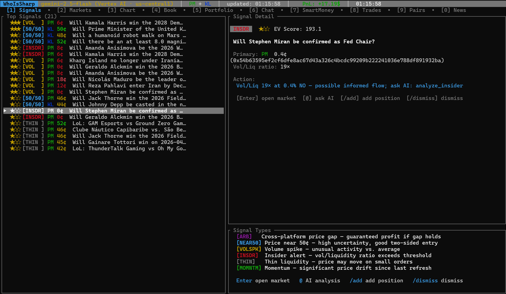

# WhoIsSharp

> The Intelligence Layer for Professional Prediction Traders.

<p align="center">
  <a href="https://github.com/Koukyosyumei/WhoIsSharp/" target="_blank">
      
  </a>
</p>


WhoIsSharp is a high-performance terminal designed for institutional-grade analysis of [Polymarket](https://polymarket.com) and [Kalshi](https://kalshi.com). It combines real-time microstructure data with a proprietary 5-layer AI framework to detect arbitrage, profile smart money, and quantify edge.

<p align="center">
  <a href="https://github.com/Koukyosyumei/WhoIsSharp/" target="_blank">
      
  </a>
</p>

---

## Core Capabilities

### Signal Engine

- **Arbitrage (ARB)**: Instant detection of cross-platform price gaps.
- **Informed Flow (INSDR)**: High Vol/Liquidity ratios signaling pre-news accumulation.
- **Momentum (MOMT)**: Rapid intraday moves flagged for immediate review.
- **Microstructure (THIN)**: Advanced liquidity alerts to minimize adverse selection risk.

### Institutional Intelligence

- **Portfolio Integration**: Seamless integration with Polymarket wallet
- **Smart Money Profiling**: (Polymarket) Win-rate analysis, alpha-entry scoring, and wallet coordination clustering.
- **Global News Integration**: Context-aware sentiment analysis and article fetching via newsdata.io.
- **Live Orderbooks**: Visual bid/ask depth, spread tracking in bps, and imbalance ratios.
- **Unified Desktop**: Keyboard-driven navigation across multi-platform markets.

### The AI Analysis Framework

> The embedded AI analyst executes a structured quantitative workflow to produce high-conviction research:

1. **Fundamental Prior**: Establishing base-rate probabilities independent of market noise.
2. **Market Signal**: Statistical assessment of implied odds vs. fair value.
3. **Price Action**: Trend analysis using MA7/MA20 and volume-weighted confirmation.
4. **Microstructure**: Deep orderbook wall analysis and liquidity depth assessment.
5. **Flow Check**: Wallet-level "Smart Money" validation and insider suspicion scoring.
6. **Optimal Position**: Automatically calculates optimal position sizing via the Kelly Criterion.

---

## Quickstart

```bash
# Install via cargo
cargo install --git https://github.com/Koukyosyumei/WhoIsSharp whoissharp

# With Claude (recommended)
ANTHROPIC_API_KEY=sk-ant-... whoissharp -- --backend anthropic

# With OpenAI
OPENAI_API_KEY=sk-... whoissharp -- --backend openai

# Local model via Ollama
whoissharp -- --backend ollama --model llama3.2

# Gemini / Vertex AI
GOOGLE_APPLICATION_CREDENTIALS=/path/to/key.json \
GOOGLE_PROJECT_ID=my-project \
whoissharp-- --backend gemini
```
---

## Key bindings

**Navigation**

| Key | Action |
|-----|--------|
| `1`–`9` | Switch tabs directly |
| `0` | Open News tab for selected market |
| `Tab` / `Shift+Tab` | Cycle tabs |
| `j` / `k` | Navigate list / scroll |
| `Enter` | Select market (loads chart + book) / send chat |
| `Ctrl+C` | Quit (or cancel any active input mode) |

**Direct shortcuts**

| Key | Action |
|-----|--------|
| `^` | Refresh market data |
| `@` | Pre-fill AI analysis prompt for selected market |
| `?` | Toggle help overlay |
| `[` / `]` | Lower / raise threshold (SmartMoney & Pairs tabs) |

**Slash commands** — press `/`, type a command, press `Enter`

| Command | Action |
|---------|--------|
| `/refresh` or `/r` | Refresh markets + chart + orderbook |
| `/platform` or `/p` | Cycle platform filter (All → PM → KL) |
| `/chart` or `/c` | Cycle chart interval (1h → 6h → 1d → 1w → 1m) |
| `/sort` or `/s` | Cycle sort mode (~50% → Vol → End date → A-Z) |
| `/watchlist` or `/w` | Toggle watchlist for selected market |
| `/wf` | Toggle watchlist-only filter |
| `/alert` or `/e` | Edit price alert thresholds |
| `/add` or `/n` | Add portfolio position (multi-step) |
| `/targets` or `/t` | Set take-profit / stop-loss |
| `/delete` or `/d` | Delete selected position |
| `/dismiss` or `/x` | Dismiss signal for this session |
| `/analyze` or `/a` | Pre-fill AI analysis prompt |
| `/kelly` or `/k` | Open Kelly position-size calculator |
| `/risk` or `/v` | Toggle risk/exposure view (Portfolio tab) |
| `/pairs` or `/l` | Re-run LLM pair matching (Pairs tab) |
| `/lower` / `/raise` | Adjust threshold (SmartMoney / Pairs tab) |
| `/wallet <0x…>` | Import Polymarket wallet positions into portfolio |
| `/wallet sync` | Re-sync all registered wallet addresses |
| `/wallet analyze` or `/wa` | Ask AI to analyse registered wallet(s) |
| `/export` or `/csv` | Export current tab to CSV |
| `/report` or `/m` | Export Markdown research report |
| `/help` or `/?` | Toggle help overlay |
| `/<search term>` | Unrecognised input → filter market list |

| Special | Action |
|---------|--------|
| `!note <text>` | Append timestamped note to research log (no AI call) |

---

## Backends

| Backend | Env vars | Flag |
|---------|----------|------|
| Anthropic Claude | `ANTHROPIC_API_KEY` | `--backend anthropic` |
| Google Gemini | `GOOGLE_APPLICATION_CREDENTIALS` + `GOOGLE_PROJECT_ID` | `--backend gemini` |
| OpenAI | `OPENAI_API_KEY` | `--backend openai` |
| Ollama (local) | — | `--backend ollama --model llama3.2` |
| None (data only) | — | _(default)_ |

**Optional: news feed**

Set `NEWSDATA_API_KEY` to enable Tab 0 and the AI's `get_market_news` tool.
Get a free key (200 req/day) at [https://newsdata.io](https://newsdata.io).

Override any model: `--model claude-opus-4-6` or `WHOISSHARP_MODEL=<id>`.

---

## MCP Server (Claude Desktop integration)

WhoIsSharp can run as an [MCP (Model Context Protocol)](https://modelcontextprotocol.io) server, exposing all 14 market-analysis tools directly to Claude Desktop — no API fees beyond your existing Anthropic subscription.

### Installation

```bash
cargo install --git https://github.com/Koukyosyumei/WhoIsSharp whoissharp
```

### Claude Desktop configuration

Add the following to your `claude_desktop_config.json`
(macOS: `~/Library/Application Support/Claude/claude_desktop_config.json`,
Windows: `%APPDATA%\Claude\claude_desktop_config.json`):

```json
{
  "mcpServers": {
    "whoissharp": {
      "command": "whoissharp",
      "args": ["--mcp"],
      "env": {
        "NEWSDATA_API_KEY": "your_newsdata_key",
        "FRED_API_KEY": "your_fred_key"
      }
    }
  }
}
```

Both env vars are optional — omit either key to disable that data source.

### Available tools

Once connected, Claude can call any of these tools in conversation:

| Tool | Description |
|------|-------------|
| `list_markets` | List markets from Polymarket / Kalshi |
| `get_market` | Full details for a specific market |
| `get_orderbook` | Live bid/ask depth |
| `get_price_history` | Historical YES prices with sparkline |
| `get_events` | Event categories |
| `search_markets` | Search markets by keyword |
| `analyze_insider` | Detect informed-flow signals |
| `find_smart_money` | Rank wallets by edge score |
| `analyze_wallet` | Full profile for a single wallet |
| `scan_smart_money` | Bulk suspicious-wallet scan |
| `get_wallet_positions` | Current positions for a wallet |
| `kelly_size` | Kelly Criterion position sizing |
| `search_news` | Fetch related news articles |
| `get_market_news` | News contextualised to a market |

### Example prompts

```
"Analyze the current order book for the Trump tariff market on Polymarket"
"Find the top smart-money wallets active in the last 24 hours"
"What does the news say about the Fed rate decision market?"
"Calculate Kelly sizing for a market I think is 65% likely but priced at 55%"
```

---

## License

Apache 2.0
